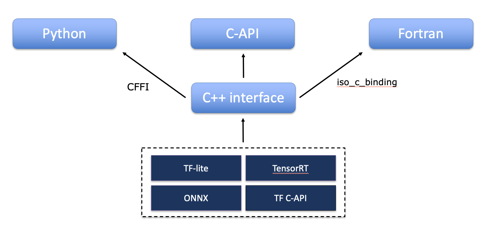

Infero
======

Description
-----------
Infero is a Machine Learning support library that runs a pre-trained Machine Learning model for inference. Infero provides a common interface to multiple inference engines and can be called from multiple languages (C/C++, Fortran, Python).

Infero requires a relatively small dependency stack and is therefore also suitable for tightly-managed HPC environments.

.. Warning:: This software is still under heavy development and not yet ready for operational use

.. toctree::
   :maxdepth: 1
   :caption: User Guide:

   User_Guide/getting_started
   User_Guide/usage_examples

Architecture
------------
Infero is designed as a thin layer on top of interchangeable inference engines (backends) and provides a common API usable by multiple programming languages. It performs three main steps:

 1. Transfers input data from the caller application to the inference engine
 2. Runs the inference engine
 3. Transfers the output data back to the caller application

Infero accepts commonly used Input/output data formats for each language of the API. For example, a C++ application will transfer data to/from Infero as raw memory buffers, a Python application will use numpy objects and a Fortran application Fortran arrays.

.. image:: _static/infero_diagram.png
   :width: 90%
   :align: center
   :alt: Infero diagram

Infero is primarily developed in C++, but provides API for multiple languages. A diagram of the API architecture is
shown here below:

Features
--------
* API available for multiple languages:
   * C, C++, Fortran, Python
* Inference Engines supported:
   * `TensorFlow LITE <https://github.com/tensorflow/tensorflow>`__
   * `TensorFlow C-API <https://www.tensorflow.org/install/lang_c>`__
   * `ONNX-Runtime <https://github.com/Microsoft/onnxruntime>`__
   * `TensorRT <https://developer.nvidia.com/tensorrt>`__
* Support for Multiple-input Multiple-output models
* Automatic handling of C-style and Fortran-style tensors

License
-------
*Infero* is available under the open source `Apache License`__. In applying this licence, ECMWF does not waive the privileges and immunities granted to it by virtue of its status as an intergovernmental organisation nor does it submit to any jurisdiction.

__ http://www.apache.org/licenses/LICENSE-2.0.html

:Authors:
    Antonino Bonanni, James Hawkes, Tiago Quintino
:Version: 0.1.0